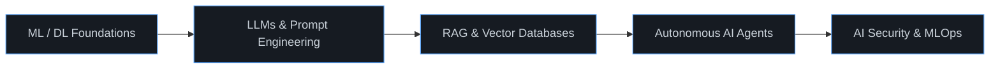

<!--
  =========================================================
  AJINTH KUMAR — GITHUB PROFILE README
  Replace every "ajinthkumar" with your real GitHub username
  and update the links marked with 🔧.
  =========================================================
-->

 

 

 

## About

B.Tech student in Artificial Intelligence & Data Science, working across machine learning, generative AI, full-stack engineering, and AI-driven cybersecurity. I focus on turning research-grade AI concepts — LLM agents, RAG pipelines, speech systems — into reliable, well-designed products.

**Currently exploring:** multi-agent orchestration, retrieval-augmented generation at scale, and AI-assisted threat detection.

 

## Tech Stack

<table>
<tr>
<td valign="top" width="16%"><b>Languages</b></td>
<td valign="top"></td>
</tr>
<tr>
<td valign="top"><b>Frontend</b></td>
<td valign="top"></td>
</tr>
<tr>
<td valign="top"><b>Backend</b></td>
<td valign="top"></td>
</tr>
<tr>
<td valign="top"><b>AI / ML</b></td>
<td valign="top"></td>
</tr>
<tr>
<td valign="top"><b>Data</b></td>
<td valign="top"></td>
</tr>
<tr>
<td valign="top"><b>DevOps / Cloud</b></td>
<td valign="top"></td>
</tr>
</table>

<b>Also working with:</b> LangChain · OpenRouter · Ollama · Transformers · Whisper · XTTS · Vosk · JWT / OAuth · REST APIs · MITRE ATT&CK

 

## AI Specialization

| Area | Proficiency |
|---|---|
| LLMs, RAG & AI Agents | `██████████████████░░` 90% |
| Full Stack Development | `███████████████████░` 95% |
| NLP & Speech AI | `█████████████████░░░` 85% |
| Machine Learning | `████████████████░░░░` 80% |
| Cybersecurity Automation | `███████████████░░░░░` 75% |
| Computer Vision | `██████████████░░░░░░` 70% |

 

## Featured Projects

<table>
<tr>
<td width="50%" valign="top">

**[SHABDHAM](https://github.com/ajinthkumar/shabdham)**
AI-powered multilingual voice assistant — speech recognition, speech synthesis, conversational AI, and an immersive real-time UI.
`Speech Recognition` `TTS` `Conversational AI`

</td>
<td width="50%" valign="top">

**[SentinelAI](https://github.com/ajinthkumar/sentinelai)**
Autonomous AI-powered SOC platform for threat detection, attack analysis, MITRE ATT&CK mapping, and incident response.
`Threat Detection` `SOC Automation`

</td>
</tr>
<tr>
<td width="50%" valign="top">

**[Stydes](https://github.com/ajinthkumar/stydes)**
AI-based house planning platform using computer vision and intelligent layout generation.
`Computer Vision` `Layout Generation`

</td>
<td width="50%" valign="top">

**[StyJobs](https://github.com/ajinthkumar/styjobs)**
AI career platform with ATS analysis, resume optimization, interview prep, and CareerScore.
`ATS Analysis` `Career Tools`

</td>
</tr>
<tr>
<td width="50%" valign="top">

**[AI Image Generator](https://github.com/ajinthkumar/ai-image-generator)**
Modern, minimal AI image generation web app.
`Generative AI` `Diffusion Models`

</td>
<td width="50%" valign="top">

**[AI Calling Agent](https://github.com/ajinthkumar/ai-calling-agent)**
Human-like multilingual AI calling system with CRM integration, speech understanding, and sentiment analysis.
`Voice AI` `CRM Integration`

</td>
</tr>
</table>

 

## Learning Roadmap

 

## Certifications

> 🔧 _Add your certifications, e.g._
> - [ ] Deep Learning Specialization — DeepLearning.AI
> - [ ] AWS Certified Cloud Practitioner

 

## Connect

