<!--
  =========================================================
  AJINTH KUMAR — GITHUB PROFILE README
  Replace every instance of "ajinthkumar" below with your
  actual GitHub username, and update the social links,
  email, and certification placeholders marked with 🔧.
  =========================================================
-->

<div align="center">

<!-- ===== ANIMATED HERO BANNER ===== -->


<!-- ===== TYPING ANIMATION ===== -->
<a href="https://git.io/typing-svg">
  
</a>

<!-- ===== PIXEL-STYLE AVATAR ===== -->


<br/>

<!-- ===== PREMIUM BADGES ===== -->
<p>
  
  
  
  
</p>


</div>


---

## 🧬 About Me

```python
class AjinthKumar:
    def __init__(self):
        self.name = "Ajinth Kumar"
        self.role = [
            "AI Engineer",
            "Full Stack Developer",
            "Machine Learning Engineer",
            "Generative AI Developer",
            "Cybersecurity & AI Automation Enthusiast",
        ]
        self.education = "B.Tech in Artificial Intelligence & Data Science"
        self.focus = "Building autonomous AI systems that solve real-world problems"
        self.mindset = "Ship fast. Design beautifully. Automate everything."

    def current_status(self):
        return "🚀 Exploring LLM agents, RAG pipelines & AI-driven security"
```

<table>
<tr>
<td width="50%" valign="top">

### 📌 Professional Summary
I design and build intelligent, production-grade systems across the full stack — from neon-lit React interfaces down to the model weights powering them. My work spans **generative AI**, **autonomous agents**, **speech AI**, and **AI-driven cybersecurity**, always with an obsession for clean architecture and polished UX.

</td>
<td width="50%" valign="top">

### 🎯 Current Focus
- 🤖 Advanced AI Agents & multi-agent orchestration
- 🔎 Retrieval-Augmented Generation (RAG) at scale
- 🛡️ AI-powered SOC & threat detection tooling
- 🎙️ Real-time multilingual voice AI systems

</td>
</tr>
</table>


## ⚡ Technology Stack

<div align="center">

**Languages**
<br/>


**Frontend**
<br/>

<br/>


**Backend**
<br/>

<br/>


**Databases**
<br/>


**DevOps & Cloud**
<br/>

<br/>


</div>


## 🧠 AI Specialization

<div align="center">

</div>

<table>
<tr>
<td width="33%" valign="top">

#### Core AI/ML
- Machine Learning & Deep Learning
- Neural Networks
- Computer Vision
- Natural Language Processing
- Model Training & Evaluation
- Feature Engineering

</td>
<td width="33%" valign="top">

#### Generative AI & Agents
- Large Language Models (LLMs)
- Prompt Engineering
- RAG Pipelines
- Autonomous AI Agents
- LangChain · Hugging Face
- OpenRouter · Ollama · Transformers

</td>
<td width="33%" valign="top">

#### Speech & Security AI
- Whisper · XTTS · Vosk
- Voice Cloning
- Threat Detection & MITRE ATT&CK
- SOC Workflow Automation
- Log Analysis
- AI-Powered Security Systems

</td>
</tr>
</table>

### AI Expertise Levels

```
LLMs & Prompt Engineering   ████████████████████░░░░  85%
Machine Learning            ███████████████████░░░░░  80%
Computer Vision             ████████████████░░░░░░░░  70%
NLP & Speech AI             ████████████████████░░░░  85%
AI Agents / RAG Systems     ██████████████████████░░  90%
Cybersecurity Automation    ██████████████████░░░░░░  75%
Full Stack Development      ███████████████████████░  95%
```

<details>
<summary><b>📊 Circular Skill Radar (click to expand)</b></summary>
<br/>

<svg width="420" height="420" viewBox="0 0 420 420" xmlns="http://www.w3.org/2000/svg">
  <defs>
    <radialGradient id="bg" cx="50%" cy="50%" r="70%">
      <stop offset="0%" stop-color="#0A0A0F"/>
      <stop offset="100%" stop-color="#111119"/>
    </radialGradient>
  </defs>
  <rect width="420" height="420" fill="url(#bg)" rx="16"/>
  <g stroke="#233" fill="none">
    <circle cx="210" cy="210" r="160" opacity="0.25" stroke="#00E5FF"/>
    <circle cx="210" cy="210" r="120" opacity="0.25" stroke="#00E5FF"/>
    <circle cx="210" cy="210" r="80" opacity="0.25" stroke="#00E5FF"/>
    <circle cx="210" cy="210" r="40" opacity="0.25" stroke="#00E5FF"/>
  </g>
  <polygon points="210,60 340,160 300,320 120,320 80,160"
    fill="#FF6A00" fill-opacity="0.25" stroke="#FF6A00" stroke-width="2"/>
  <g fill="#E6F7FF" font-family="Fira Code, monospace" font-size="12">
    <text x="210" y="45" text-anchor="middle">AI Agents / RAG</text>
    <text x="350" y="160" text-anchor="start">Full Stack</text>
    <text x="300" y="340" text-anchor="middle">NLP / Speech</text>
    <text x="120" y="340" text-anchor="middle">ML / DL</text>
    <text x="55" y="160" text-anchor="end">Cybersecurity</text>
  </g>
</svg>

</details>


## 🚀 Featured Projects

<table>
<tr>
<td width="50%">

### 🗣️ [SHABDHAM](https://github.com/ajinthkumar/shabdham)
AI-powered **multilingual voice assistant** featuring speech recognition, speech synthesis, conversational AI, and an immersive real-time UI.

`Speech Recognition` `TTS` `Conversational AI` `Multilingual`

</td>
<td width="50%">

### 🛡️ [SentinelAI](https://github.com/ajinthkumar/sentinelai)
Autonomous **AI-powered SOC platform** for cybersecurity threat detection, attack analysis, MITRE ATT&CK mapping, and intelligent incident response.

`Threat Detection` `MITRE ATT&CK` `SOC Automation`

</td>
</tr>
<tr>
<td width="50%">

### 🏠 [Stydes](https://github.com/ajinthkumar/stydes)
AI-based **house planning platform** using computer vision and intelligent layout generation for smarter architectural design.

`Computer Vision` `Layout Generation` `AI Design`

</td>
<td width="50%">

### 💼 [StyJobs](https://github.com/ajinthkumar/styjobs)
AI **career platform** with ATS analysis, resume optimization, interview preparation, CareerScore, and job-readiness tools.

`ATS Analysis` `Resume AI` `Career Tools`

</td>
</tr>
<tr>
<td width="50%">

### 🎨 [AI Image Generator](https://github.com/ajinthkumar/ai-image-generator)
Modern AI image generation web application with a fast, minimal, and responsive interface.

`Generative AI` `Diffusion Models` `Gradio`

</td>
<td width="50%">

### ☎️ [AI Calling Agent](https://github.com/ajinthkumar/ai-calling-agent)
Human-like **multilingual AI calling system** with CRM integration, speech understanding, sentiment analysis, and automated workflows.

`Voice AI` `CRM Integration` `Sentiment Analysis`

</td>
</tr>
</table>


## 📈 GitHub Analytics

<div align="center">


</div>

<!-- ===== SNAKE CONTRIBUTION ANIMATION ===== -->
<!-- 🔧 Generate this via the "platane/snk" GitHub Action in your own repo, then embed the raw SVG URL below -->
<div align="center">

</div>


## 🏆 Open Source & Achievements

- 🌱 Actively contributing to AI tooling & automation repositories
- 🧩 Building and maintaining multiple full-stack AI product prototypes
- 🎓 Continuous learner across ML research papers & agentic frameworks
- 🏅 Hackathon builder — rapid-prototyping AI-first products

### 📜 Certifications
> 🔧 _Add your certifications here, e.g._
> - [ ] Deep Learning Specialization — DeepLearning.AI
> - [ ] AWS Certified Cloud Practitioner
> - [ ] Add your own credential links


## 🗺️ Learning Roadmap

```mermaid
graph LR
    A[Foundations: Python/ML] --> B[Deep Learning & CV/NLP]
    B --> C[LLMs & Prompt Engineering]
    C --> D[RAG & Vector Databases]
    D --> E[Autonomous AI Agents]
    E --> F[AI Security & MLOps]
    F --> G[Scaling Production AI Systems]

    style A fill:#0A0A0F,stroke:#00E5FF,color:#E6F7FF
    style B fill:#0A0A0F,stroke:#00E5FF,color:#E6F7FF
    style C fill:#0A0A0F,stroke:#FF6A00,color:#E6F7FF
    style D fill:#0A0A0F,stroke:#FF6A00,color:#E6F7FF
    style E fill:#0A0A0F,stroke:#00E5FF,color:#E6F7FF
    style F fill:#0A0A0F,stroke:#FF6A00,color:#E6F7FF
    style G fill:#0A0A0F,stroke:#00E5FF,color:#E6F7FF
```



## 💭 Tech Philosophy

> "Good AI systems are invisible — they just make things work."
> Design with empathy. Engineer with precision. Automate with responsibility.

## 🎲 Fun Facts

- 🌙 Most productive between midnight and 3 AM
- ☕ Debugs better with coffee and lo-fi beats
- 🕹️ Enjoys building side projects that blend AI with everyday utility
- 📚 Reads AI research papers for fun (and for the roadmap above)


## 📬 Contact & Connect

<div align="center">

<!-- 🔧 Replace with your real profile links -->
<a href="mailto:ajinthkumar@example.com"></a>
<a href="https://linkedin.com/in/ajinthkumar"></a>
<a href="https://github.com/ajinthkumar"></a>
<a href="https://twitter.com/ajinthkumar"></a>
<a href="https://huggingface.co/ajinthkumar"></a>

</div>

<div align="center">

### ✨ "The best way to predict the future is to build it — with AI as your co-pilot." ✨

</div>


