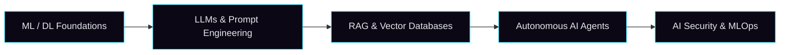

<!--
  AJINTH KUMAR — GITHUB PROFILE README

  Custom animated SVG graphics live in ./assets/ (hero-banner, divider,
  skills-radar, stat-strip). These use native SVG/SMIL animation
  (<animate>, <animateTransform>, <animateMotion>) — floating 3D cubes,
  a rotating radar sweep, a shimmer sweep across the banner, and
  glowing pulsing nodes. No JavaScript required; they animate on their own
  wherever an  is rendered, including on GitHub.

  SETUP:
  1. Create a repo named exactly like your GitHub username (ajinthkumar/ajinthkumar).
  2. Put this README.md at the root, and keep the assets/ folder alongside it.
  3. Replace every "ajinthkumar" below with your real username, and update
     the links marked with 🔧.
-->

  

# Ajinth Kumar

<b>AI ENGINEER</b> &nbsp;·&nbsp; <b>FULL STACK DEVELOPER</b> &nbsp;·&nbsp; <b>MACHINE LEARNING ENGINEER</b>

  

  

B.Tech, Artificial Intelligence &amp; Data Science
&nbsp;·&nbsp;
<a href="mailto:ajinthkumar@example.com">Email</a>
&nbsp;·&nbsp;
<a href="https://linkedin.com/in/ajinthkumar">LinkedIn</a>
&nbsp;·&nbsp;
<a href="https://github.com/ajinthkumar">GitHub</a>
&nbsp;·&nbsp;
<a href="https://huggingface.co/ajinthkumar">Hugging Face</a>

 

 

## Overview

I build AI systems end to end — from model and pipeline design through to the product interfaces people actually use. My work spans machine learning, generative AI and autonomous LLM agents, full-stack engineering, and AI-driven security tooling. The goal is always the same: take research-grade AI techniques and turn them into software that is fast, reliable, and quietly well designed.

**Currently focused on** — multi-agent orchestration · retrieval-augmented generation at scale · applying AI to threat detection

 

 

 

## Stack

<table width="100%">
<tr><td width="18%"><b>LANGUAGES</b></td><td></td></tr>
<tr><td><b>AI / ML</b></td><td></td></tr>
<tr><td><b>FRONTEND</b></td><td></td></tr>
<tr><td><b>BACKEND</b></td><td></td></tr>
<tr><td><b>DATA</b></td><td></td></tr>
<tr><td><b>INFRA</b></td><td></td></tr>
</table>

Also: LangChain · OpenRouter · Ollama · Transformers · Whisper · XTTS · Vosk · JWT / OAuth · REST APIs · MITRE ATT&amp;CK

 

 

 

## Projects

<table width="100%">
<tr>
<td width="50%" valign="top">
<h4>SHABDHAM</h4>

AI-powered multilingual voice assistant — speech recognition, speech synthesis, conversational AI, and a real-time interface.

Speech Recognition · TTS · Conversational AI
  
<a href="https://github.com/ajinthkumar/shabdham">→ Repository</a>
</td>
<td width="50%" valign="top">
<h4>SentinelAI</h4>

Autonomous AI-powered SOC platform for threat detection, attack analysis, MITRE ATT&amp;CK mapping, and incident response.

Threat Detection · SOC Automation
  
<a href="https://github.com/ajinthkumar/sentinelai">→ Repository</a>
</td>
</tr>
<tr>
<td width="50%" valign="top">
<h4>Stydes</h4>

AI-based house planning platform using computer vision and intelligent layout generation.

Computer Vision · Layout Generation
  
<a href="https://github.com/ajinthkumar/stydes">→ Repository</a>
</td>
<td width="50%" valign="top">
<h4>StyJobs</h4>

AI career platform with ATS analysis, resume optimization, interview preparation, and a CareerScore metric.

ATS Analysis · Career Tools
  
<a href="https://github.com/ajinthkumar/styjobs">→ Repository</a>
</td>
</tr>
<tr>
<td width="50%" valign="top">
<h4>AI Image Generator</h4>

A modern, minimal AI image generation web application.

Generative AI · Diffusion Models
  
<a href="https://github.com/ajinthkumar/ai-image-generator">→ Repository</a>
</td>
<td width="50%" valign="top">
<h4>AI Calling Agent</h4>

Human-like multilingual AI calling system with CRM integration, speech understanding, and sentiment analysis.

Voice AI · CRM Integration
  
<a href="https://github.com/ajinthkumar/ai-calling-agent">→ Repository</a>
</td>
</tr>
</table>

 

 

## Roadmap

 

 

## Certifications

🔧 Add your certifications, e.g.
- Deep Learning Specialization — DeepLearning.AI
- AWS Certified Cloud Practitioner

 

Building AI systems that are reliable, secure, and genuinely useful.

  

